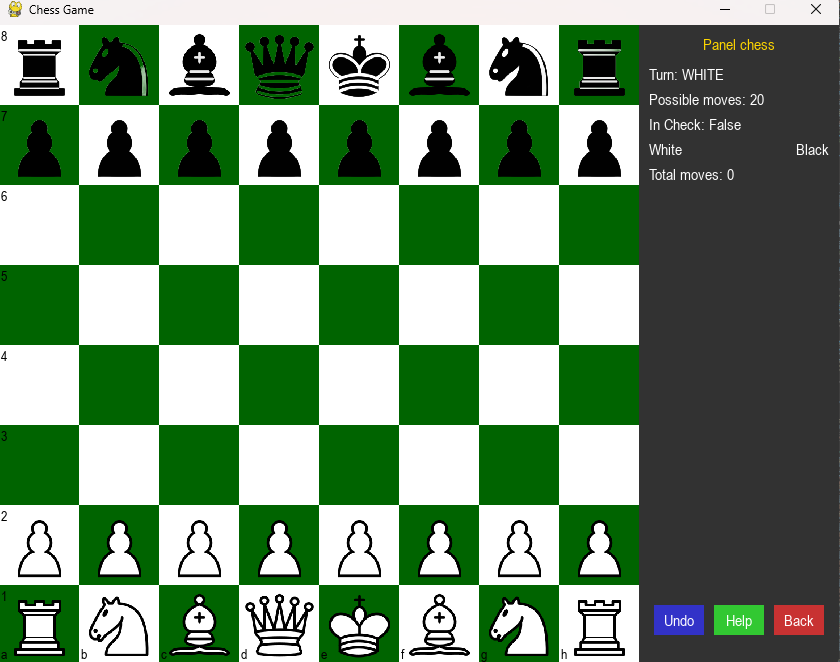

# chess_group7

Link Demo dự án : https://www.youtube.com/watch?v=yAXUPCf1pG8

📘 Mô tả dự án:
Dự án này là một trò chơi cờ vua được phát triển bằng ngôn ngữ Python.
.....

# 🚀 Git Flow Guidelines

Quy trình làm việc với Git Flow sử dụng các nhánh:
- `main` – mã đã phát hành (production-ready)
- `develop` – mã tổng hợp, chuẩn bị cho phát hành tiếp theo
- `feature/*` – nhánh con để phát triển từng tính năng

---

## 🔁 Nhánh chính trong Git Flow

| Nhánh       | Mục đích                                 |
|-------------|-------------------------------------------|
| `main`      | Chứa mã ổn định đã phát hành              |
| `develop`   | Tổng hợp các tính năng, chuẩn bị release  |
| `feature/*` | Phát triển tính năng cụ thể               |
| `release/*` | Chuẩn bị phát hành chính thức             |
| `hotfix/*`  | Sửa lỗi khẩn cấp từ bản đã release        |

---

## 🛠️ Bắt đầu một tính năng mới

```bash
git checkout develop
git pull origin develop (đảm bảo develop luôn có code mới nhất)
git checkout -b feature/tinh-nang-moi
```

Làm việc và commit bình thường trên nhánh `feature`.

---

## 🔄 Cập nhật code mới từ `develop` vào nhánh `feature`

### Cách 1: Dùng merge (an toàn, dễ dùng)
```bash
git checkout develop
git pull origin develop (đảm bảo develop luôn có code mới từ remote)

git checkout feature/tinh-nang-moi
git merge develop
```

### Cách 2: Dùng rebase (lịch sử gọn đẹp hơn)
```bash
git checkout feature/tinh-nang-moi
git fetch origin
git rebase origin/develop
```

> ⚠️ Nếu đã push nhánh feature trước đó:
> ```bash
> git push origin feature/tinh-nang-moi --force
> ```

---

## ✅ Merge feature vào develop khi hoàn tất

```bash
git checkout develop
git pull origin develop
git merge feature/tinh-nang-moi
git push origin develop
```

---

## 📦 Chuẩn bị bản phát hành (Release)

```bash
git checkout develop
git checkout -b release/v1.0.0
# Fix bug nhỏ, cập nhật version...

# Merge vào main + tag
git checkout main
git merge release/v1.0.0
git tag v1.0.0

# Merge ngược lại vào develop
git checkout develop
git merge release/v1.0.0

# Xoá nhánh release nếu muốn
git branch -d release/v1.0.0
```

---

## 🔥 Hotfix – sửa lỗi khẩn cấp

```bash
git checkout main
git checkout -b hotfix/fix-bug-nghiem-trong

# Sau khi fix:
git checkout main
git merge hotfix/fix-bug-nghiem-trong
git tag v1.0.1

git checkout develop
git merge hotfix/fix-bug-nghiem-trong
```

---

## 💼 Stash – lưu tạm thay đổi khi đang làm dở

```bash
git stash                # Lưu lại thay đổi tạm thời
git stash list           # Xem danh sách stash
git stash apply          # Áp dụng lại thay đổi
git stash pop            # Áp dụng + xoá khỏi stash
git stash drop stash@{0} # Xoá stash cụ thể
git stash clear          # Xoá tất cả stash
```

---

## 🧠 Ghi nhớ khi chuyển nhánh

| Tình huống                              | Giải pháp                              |
|----------------------------------------|----------------------------------------|
| Đang code dở, muốn chuyển nhánh khác   | `git stash` rồi `git checkout`         |
| Muốn đồng bộ tính năng với develop     | `git pull origin develop` hoặc `rebase`|
| Nhánh nhiều commit rời rạc             | `git rebase -i` để gộp lại              |
| Đã merge nhánh feature xong            | Có thể xoá nhánh feature (`-d`)        |

---

## 📌 Gợi ý đặt tên nhánh

- `feature/login-form`
- `feature/user-profile`
- `release/v1.2.0`
- `hotfix/fix-crash-on-start`

---


## 📁 Cấu trúc thư mục
- `Engine/` - Chứa mã xây dựng engine.
- `game/` - Chứa mã liên quan đến giao diện và logic trò chơi.
- `music/` - Chứa file âm thanh.
- `image/` - Chứa hình ảnh của quân cờ và bàn cờ.
- `bot_vs_stockfish.py` - Script để đấu bot với Stockfish.
- `game.py` - File chính để chạy trò chơi.

 
## 🖼️ Giao diện tổng quan


## 🎮 Giao diện chơi 1 vs 1


## 🤖 Giao diện chơi với AI


## 🌟 Sơ đồ Git Flow (đơn giản hoá)

```plaintext
main  ----o-------------------------o-------------o-- (v1.0.0) --o-- (v1.0.1)
              \                   /
develop         o----o---o----o--o----o---o-------/
                 \        \
feature/a         o--o     \
feature/b            o--o
```


## 📬 Tips cho teamwork

- Luôn pull `develop` trước khi tạo nhánh feature mới
- Tạo Pull Request khi merge
- Tránh push lên `main` trực tiếp
- Review kỹ trước khi release


## Nguồn tham khảo
Dự án đã tham khảo mã nguồn và ý tưởng từ các dự án cờ vua sau:

- [Halogen](https://github.com/KierenP/Halogen) - Engine cờ vua mã nguồn mở.
- [Deepov](https://github.com/jhonnold/deepov) - Một engine cờ vua khác.
- [Duchess](https://github.com/bhlangonijr/duchess) - Engine cờ vua mạnh mẽ.
- [Kingfish](https://github.com/adityachirlun/kingfish) - Engine cờ vua đơn giản.
- [PlentyChess](https://github.com/LeelaChessZero/plentychess) - Engine cờ vua hiện đại.
- [Chess-ENGINE](https://github.com/Chess-ENGINE/Chess-ENGINE) - Dự án phát triển engine cờ vua.
- [Leela Chess Zero (Lc0)](https://lczero.org/) - Engine cờ vua sử dụng AI và mạng nơ-ron.
- [Sunfish](https://github.com/thomasahle/sunfish) - Engine cờ vua nhẹ, viết bằng Python.

